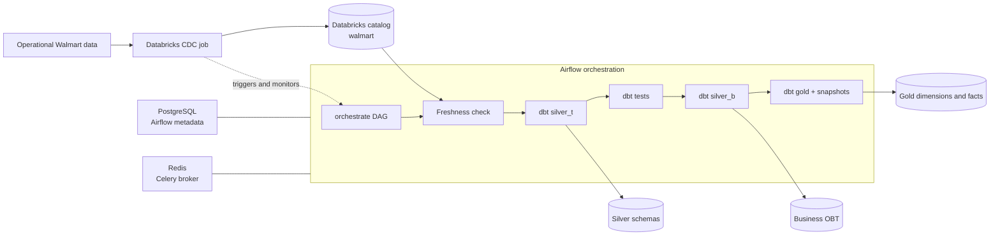
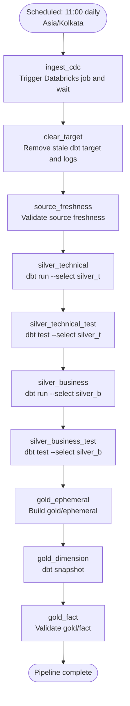
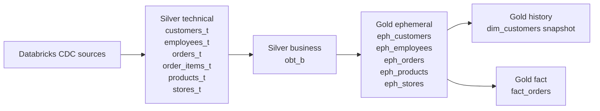

# Walmart Data Platform

<p align="center">
  <strong>CDC ingestion, transformation, testing, and history tracking with Airflow, Databricks, and dbt.</strong>
</p>

<p align="center">
  <a href="https://airflow.apache.org/"></a>
  <a href="https://www.getdbt.com/"></a>
  <a href="https://www.databricks.com/"></a>
  <a href="https://www.docker.com/"></a>
</p>

This repository contains a local, Docker-based data platform for Walmart order data. Apache Airflow orchestrates the pipeline, Databricks performs CDC ingestion and hosts the analytical warehouse, and dbt builds tested silver and gold models.

## Architecture



### Pipeline sequence



The DAG is configured with `catchup=False` and runs once per day. A failed task stops downstream work, so quality checks are part of the delivery path rather than a separate afterthought.

## Data layers



| Layer | Purpose | Materialization |
| --- | --- | --- |
| `silver_t` | Technical cleanup and CDC-shaped entities | Tables in the `silver_t` schema |
| `silver_b` | Business-level order-wide table (`obt_b`) | Tables in the `silver_b` schema |
| `gold/ephemeral` | Reusable intermediate dimension logic | Ephemeral models |
| `gold` snapshots | Historical dimension records | Snapshot tables in the `gold` schema |
| `gold/fact` | Order-level analytical facts | Tables in the `gold` schema |

## Repository map

```text
.
├── README.md
├── pyproject.toml                         # Python package and dependency metadata
├── src/walmart_dbt/                       # Python package entry point
├── walmart_project/                       # Standalone dbt project
│   ├── models/source/
│   │   ├── silver_t/                     # Technical silver models
│   │   ├── silver_b/                     # Business silver models
│   │   └── gold/                         # Ephemeral and fact models
│   ├── snapshots/                        # Slowly changing dimension snapshots
│   ├── tests/                             # Singular dbt tests
│   ├── macros/                            # Project macros
│   ├── profiles.yml                      # Databricks connection template
│   └── dbt_project.yml
└── walmart_airflow_dbt_project/          # Dockerized Airflow runtime
	├── dags/orchestrate.py               # Pipeline definition
	├── docker-compose.yaml               # Airflow, Redis, and PostgreSQL
	├── Dockerfile
	├── requirements.txt
	└── walmart_project/                   # Mounted dbt project used by Airflow
```

The top-level `walmart_project` and the copy mounted into Airflow should be kept in sync when dbt code changes.

## Quick start

### Prerequisites

- Docker Desktop with at least 4 GB of memory and 2 CPUs allocated
- A Databricks workspace, SQL warehouse, and CDC ingestion job
- Git

### 1. Configure the runtime

From PowerShell:

```powershell
cd .\walmart_airflow_dbt_project
Copy-Item .env.example .env -ErrorAction SilentlyContinue
```

Create `.env` if `.env.example` is not present, then provide the values used by the compose file and dbt profile:

```dotenv
AIRFLOW_UID=50000
FERNET_KEY=<generate-a-fernet-key>
DATABRICKS_HOST=https://<workspace-host>
DATABRICKS_TOKEN=<store-locally-and-never-commit>
```

The current DAG also contains placeholder Databricks connection values in `dags/orchestrate.py`. Replace that connection with environment-backed configuration or an Airflow connection before running against a real workspace. Do not commit tokens, passwords, or keys.

### 2. Build and start Airflow

```powershell
docker compose build
docker compose up airflow-init
docker compose up -d
```

Open the Airflow UI at [http://localhost:8080](http://localhost:8080). The default local credentials are `airflow` / `airflow` unless changed in `.env`.

To follow service logs:

```powershell
docker compose logs -f airflow-scheduler
```

To stop the stack:

```powershell
docker compose down
```

Add `-v` to `docker compose down` only when you intentionally want to remove the local Airflow metadata volume.

## Running dbt locally

The dbt project targets Databricks through `profiles.yml` and reads `DATABRICKS_HOST` and `DATABRICKS_TOKEN` from the environment.

```powershell
cd .\walmart_project
dbt deps
dbt debug
dbt source freshness
dbt run
dbt test
```

Useful focused commands:

```powershell
dbt run --select silver_t
dbt test --select silver_t
dbt run --select silver_b
dbt test --select silver_b
dbt run --select gold/ephemeral
dbt snapshot
dbt test --select gold/fact
```

## Quality and history

- Source freshness runs before transformations.
- Silver technical and business layers have dedicated dbt test stages.
- `tests/test_obt.sql` warns when required order, product, employee, store, order-item, or customer keys are missing from `obt_b`.
- Customer history is captured by the `dim_customers` timestamp snapshot using `customer_id` as the unique key and `customer_updated_timestamp` as the change marker.

## Operations notes

- This compose setup is intended for local development, not production deployment.
- Airflow uses `CeleryExecutor`, PostgreSQL for metadata, and Redis as the Celery broker.
- Airflow starts with DAGs paused. Unpause `orchestrate` in the UI after configuration is complete.
- The DAG currently has a start date of September 21, 2026 and a daily schedule of `0 11 * * *` in `Asia/Kolkata`.
- `target/` and dbt `logs/` are cleared at the beginning of each scheduled run by design.

## Useful references

- [Apache Airflow Docker deployment](https://airflow.apache.org/docs/apache-airflow/stable/howto/docker-compose/index.html)
- [dbt documentation](https://docs.getdbt.com/docs/introduction)
- [Databricks SQL connector and dbt](https://docs.getdbt.com/docs/available-adapters/databricks)
